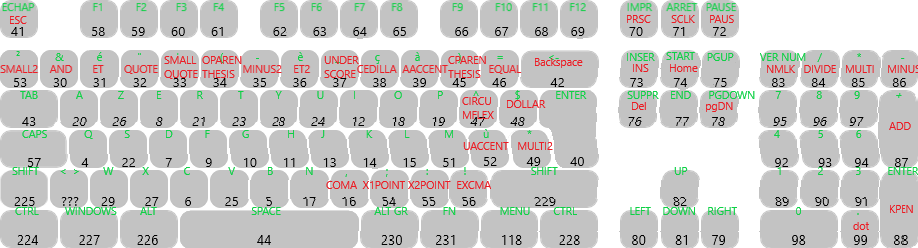

# KeyboardHID - Arduino UNO Azerty Keyboard HID
Library to use the Arduino Uno as an Azerty Keyboard, using the "[Arduino-keyboard-0.3.hex](https://github.com/coopermaa/USBKeyboard/blob/master/firmware/Arduino-keyboard-0.3.hex)" firmware

## Getting Started
Install the library using [the .zip file from the latest release](https://github.com/FireDroX/Arduino-Uno_Keyboard-HID/releases/latest/)
Run one of the library examples in the Arduino IDE by going to `File -> Examples -> Arduino UNO keyboard HID - Azerty`.

Once the code is on the Arduino, open [Flip 3.4](https://www.microchip.com/en-us/development-tool/flip).
Do `Select a Target Device -> ATmega16U2` then open the USB port connection by clicking on the USB icon (on CTRL + U).
Go to `File -> Load HEX file... (or CTRL + J)` and apply the "[Arduino-keyboard-0.3.hex](https://github.com/coopermaa/USBKeyboard/blob/master/firmware/Arduino-keyboard-0.3.hex)" file. Click `Run` and `Start Application`.

## Important 
To go back to the original Arduino with the USB Serial firmware, simply do the same thing as before with the "[Arduino-usbserial-uno.hex](https://github.com/arduino/ArduinoCore-avr/blob/master/firmwares/atmegaxxu2/arduino-usbserial/Arduino-usbserial-uno.hex)" file.

## Keycodes

    

All the codes are in the <a href="src/KeyboardHID.h" target="_blank">KeyboardHID.h</a> file.
